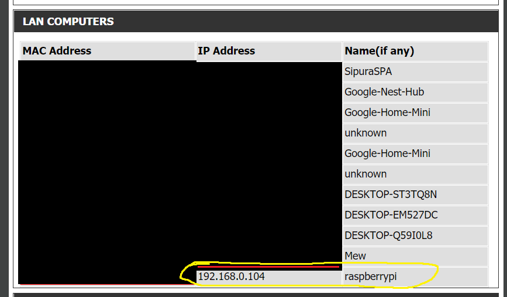
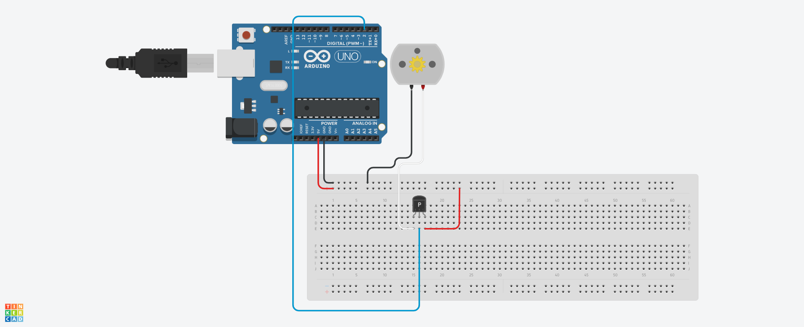

# About
Bailey is a basil plant that I display live on my Twitch.

# Listen for Events on StreamLabs
## Installing SocketIO
This part is a bit tricky. I spent a bunch of time trying to connect NodeJS & Twitch realizing that I did not use the correct version. The newer versions do not work the way you want to. Use this line instead:
(Node)
```
npm install socket.io-client@2.3.1
```

## Implementing SocketIO
To connect to StreamLabs using SocketIO, simply copy the following:
(JavaScript)
```js
const io = require("socket.io-client");
//Connect to socket
const token = process.env.STREAMLABS_SOCKET_API_TOKEN; // you can just put your token here
const streamlabs = io(
	`https://sockets.streamlabs.com?token=` + token,
	{ transports: ["websocket"] }
);
```

## Getting SocketAPI 
To get your Socket API Token, go to https://streamlabs.com/dashboard. Settings (bot left) > API Settings > API Tokens > Your Socket API Token.

## Event Example
When somebody subscribes, send an HTTP GET request using XMLHttpRequest. (This will ultimately water my plant on the raspberry-pi end)
```js
if (eventData.for === "twitch_account" && eventData.type == "subscription") {
		// console.log("New subscriber!");
		var xhr = new XMLHttpRequest();
		var url = baseUrl + "subscribe";
		xhr.open("GET", url);
		xhr.onreadystatechange = function () {
			if (xhr.readyState === 4) {
				console.log(xhr.status);
				console.log(xhr.responseText);
			}
		};
		xhr.send();
	}
```

## StreamLabs SocketAPI Docs
Use this link to see more events you can listen for and more code examples.
https://dev.streamlabs.com/docs/socket-api

# Raspberry Pi Zero
I use a headless raspberry pi zero setup to communicate with my Node.JS application and control the submerssible DC motor to water my plant.
This is the product I bought on Amazon: https://www.amazon.ca/gp/product/B08DJ3L3B7/ref=ppx_yo_dt_b_asin_title_o02_s00?ie=UTF8&psc=1.
If you'd like a wireless setup, you will need the USB-hub expansion board as well as the Wi-Fi dongle. It doesn't come with a micro SD card, so make sure you have one!
After doing this project, It's much better to buy a Raspberry-Pi Zero with **pre-soldered GPIO pins**. My raspberry pi currently has the gpio pins pulled at an angle with rubberbands so that the connection can be made (ghetto, I know).

## Setting up R-Pi Zero
I used the Raspberry Pi Imager (https://www.raspberrypi.org/software/) to image a copy of the R-Pi Lite OS (NO GUI) (https://www.raspberrypi.org/software/operating-systems/#raspberry-pi-os-32-bit) onto a micro SD card. Ctrl + Shift + X in the raspberry pi to open the Advanced Options menu. Enable SSH and set the password. Also configure the Wi-Fi by setting your SSID, password and country accordingly.
This microSD card is going into the raspberry pi and will be the storage.
We are going with the Lite OS (no-gui) verson because we can connect and do everything through SSH. A mini HDMI port (for GUI) is not needed but is possible if you'd like a more user-friendly experience.

## Setting up SSH (for headless & wireless setup ONLY)
There are a few more things after you've imaged R-Pi Lite OS onto the microSD card.
1. Create a **blank** ssh file just named 'ssh' with **no file extension**. (You can edit file extensions on Windows by going to File Explorer > View > Check File Extensions). You can do this by right clicking in the main directory of the microSD card, creating a new Text Document and naming it 'ssh' and removing the .txt at the end.
2. Create a "wpa_supplicant.conf" file (by creating a new Text Document) and copy and paste what's in r-pi/wpa_supplicant.conf.
- Change your country to the correct 2 letter abbreviation (ISO Country Code list: https://en.wikipedia.org/wiki/List_of_ISO_3166_country_codes).
- Change the SSID to your Wi-Fi SSID and password in psk.
3. Eject your microSD card and insert into your R-Pi Zero. Power the R-Pi Zero and a blinking green light is a good sign that the R-Pi is booting up.
4. Login to your router and navigate to a list of the local computers connected. You should find a similar list:

5. Download PuTTY https://www.putty.org/ and SSH into the "pi@<insert_ip>" you see in your router list (with port 22). The SSH terminal will ask for password. The password may be 'raspberry' if you have not configured this.

## SSH Lines
To install flask (for running web server) do:
```
$ sudo apt-get install python3-flask
```

To write/edit a python file, do:
(change app.py accordingly)
```
$ sudo nano app.py
```

To run python files, do:
(To run python-2 files, replace python3 with python2).
```
$ sudo python3 app.py
```

To reboot, do:
(You may need to re-ssh back into the R-Pi)
```
$ sudo reboot
```

## rc.local
**rc.local** is one way of booting up a python script when the raspberry pi boots up. Located in the /etc directory, you can do:
```
$ sudo nano rc.local
```

and add this line
(change app.py with the directory of the script you want to run)
```
sudo python ../home/pi/app.py
```

# Electronics
The submerssible DC motors that pump water into the plant: https://www.amazon.ca/gp/product/B07TMW5CDM/ref=ppx_yo_dt_b_asin_title_o07_s00?ie=UTF8&psc=1.
DC motors cannot be activated with a GPIO pin. So I use a PNP transistor with Base connected to a GPIO pin. I essentially use a PNP transistor as a switch for the DC motor. 

Pretend Arduino is your R-Pi and the Base is connected to a GPIO pin. Sending a signal to the GPIO pin will power the DC motor.


# Chat-Bot.js
My project isn't focused on the chat bot. If you want to make one yourself, 
a very straightforward tutorial can be found here: https://dev.twitch.tv/docs/irc
